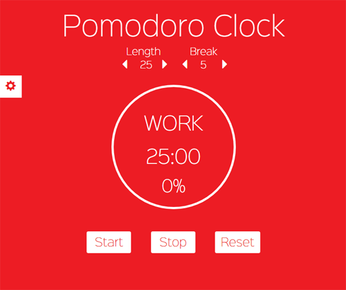

# :tomato: pomodoro
Simple app to follow the Pomodoro Work Technique

Made with Vanilla Javascript

	

## Usage

Use the **Length** arrows to set the duration of work period and **Break** arrows to set the length of the break. When work time is done a smooth **alarm** will sound.

### :link: Links
- CSS for the progress bar thanks to [this](https://www.formget.com/css-progress-bar/#circular_progress_bar) article.
- Font [CaviarDreams](https://www.fontsquirrel.com/fonts/caviar-dreams) from FONTsquirrel
- Font [SinkinSans-200XLight](https://www.fontsquirrel.com/fonts/sinkin-sans) from FONTsquirrel
### :beetle: Bugs
If you find a bug please let me know in the [issues](https://github.com/lekova/pomodoro/issues).
